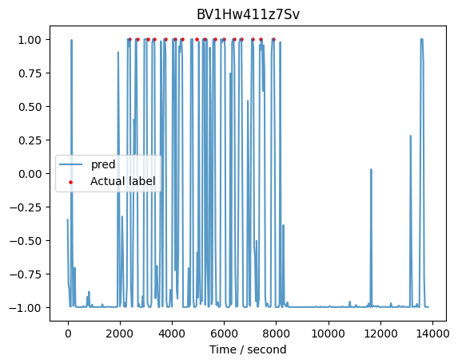

<center>
<h1>ECE539 Project Progress Report 

Singing livestream segmentation assistant</h1>
</center>

__PROJECT TEAM #__: 9

__TEAM MEMBERS__: 
| Name | Campus ID | Email | UG/PG |
| --- | --- | --- | --- |
| Avi BALAM | 9086006591 | [abalam@wisc.edu](abalam@wisc.edu) | Undergraduate |
| YUSHANG JIN | 9083280140 | [yjin248@wisc.edu](yjin248@wisc.edu) | Undergraduate |
| ZALISSA ZONGO KAFANDO | 9084045047 | [zongokafando@wisc.edu](zongokafando@wisc.edu) | Undergraduate |
  
__Date of submission__: 11/18/2023

All code and data can be accessed at [GitHub Repo](https://github.com/EricEricEricJin/ECE539-Group-Project/) and/or
[Google Drive](https://drive.google.com/drive/folders/1L5u3G65Y_pmiLBG-jFjb8EGBnHYw5gxj?usp=drive_link).

### Abstract 
A CNN model was employed to predict class probabilities for each chunk of the audio stream, distinguishing between singing and speech. The predictions were further input to a MLP to refine outcome. The accuracy of the predictions will be evaluated by comparing them with actual labels.

### Introduction
Our target is to assist in slicing singing livestream videos, that is help cutting the singing parts out from the whole livestream recording, by highlighting the potential singing partitions. The core is audio classification that distinguishes between singing and speech. "Classifying Music and Speech with Machine Learning" by Code AI demonstrated an approach to classifying audio into music or speech categories. They transfer audio into spectrogram using FFT and use a CNN model for classification.

### Method

#### Dataset

- `xxm_splitted`

    For better performance we want to train and test the model with one same person's dataset. We obtained videos on [bilibili](https://bilibili.com) in which a person only talk (no singing) and in which the same person only sing (no talking).

    The videos are crawled down (using Python, selenium and [bilili](https://github.com/yutto-dev/bilili)), converted to audio, sliced into 30-second pieces, resampled at 22050KHz, and mixed into mono channel (using Python and ffmpeg). This results in the exactly same format as `gtzan` dataset.

    Below is the summary of this dataset
    ```
    $ ls xxm_singing/*.wav | wc -l; ls xxm_speech/*.wav | wc -l
    274
    274

    $ ffprobe.exe xxm_singing/0_1.wav 
    ...
    Duration: 00:00:30.00, bitrate: 352 kb/s
    Stream #0:0: Audio: pcm_s16le ([1][0][0][0] / 0x0001), 22050 Hz, 1 channels, s16, 352 kb/s
    ```

- `xxm_mixed` 
    
    There are also long (not splitted, ~150min each) videos in which a person (same person as in `xxm_splitted`) sometimes talks and sometimes sings. There are human-labeled timestamps of starts of each singing in the description of the video. These descriptions are crawled down, parsed using regular expression, and stored in hour,min,sec format as below (one video maps to one CSV file). They are used to test and score the performance of our final program. 
    ```csv
    $ cat crawler/label/BV1134y1g7qX.csv 
    0, 19, 11
    0, 35, 31
    1, 30, 6
    1, 35, 43
    [...trunked...]
    ```

We strictly follow the rule that test data should never appear in training data. That is, all videos in `xxm_singing`, `xxm_speech`, and `xxm_mixed_train` are not from the same day's livestream of any video in `xxm_mixed_test`. 

In detail, currently we used below videos as data source:
```
xxm_singing: BV1xM411R7zn BV11C4y1Z7hW BV1q24y1c7wm BV1iu4y1D7tf
xxm_speech: BV17M41197j6 BV1KV411j75j BV1Ph411N7re BV1rh411q7dj
xxm_mixed_train: BV1uk4y1F7nv BV1bT411S7ck BV1WN41167kE BV15z4y1M7ee
xxm_mixed_test: BV1JN4y1U7ba BV1ye411X7AP BV1Hw411z7Sv BV1Gh4y1i7dv
```
(They can be downloaded using `bilili.exe https://www.bilibili.com/video/{BV} -q 16 -d {dst_dir} -y`)

Label crawling and data preprocessing are the same as in proposal. Crawler and process scripts are on [GitHub](https://github.com/EricEricEricJin/ECE539-Group-Project/tree/master/crawler). Processed data can be accessed on [Google Drive](https://drive.google.com/drive/folders/1L5u3G65Y_pmiLBG-jFjb8EGBnHYw5gxj?usp=drive_link).

#### Algorithm and program
Currently we divide the task into several Notebooks:
- [music_speech_clf.ipynb](https://colab.research.google.com/drive/17jzYx3IOyd96KqjrlRFVMA1uWFptRR1t?ouid=113889409205299075107&usp=drive_link): train the classifier CNN using `xxm_splitted`
- [pred_series_mlp_preprocess.ipynb](https://colab.research.google.com/drive/1P_RD-qyenBwgMswBVlQXAj_tTcyeNmhB?ouid=113889409205299075107&usp=drive_link): prob. series MLP data preprocessing
- [pred_series_mlp_train.ipynb](https://colab.research.google.com/drive/1dIbgPKGb9zkew6BLEHwX1z0unCJv7GgA?ouid=113889409205299075107&usp=drive_link): prob. series MLP training
- [slicer.ipynb](https://colab.research.google.com/drive/1U_0JMmrIPOmhv6MVuI-hEyTTYwarSdt6?ouid=113889409205299075107&usp=drive_link): predict (inference) using the whole model (the CNN classifier plus the prob. series MLP)

And block diagrams of our program are shown:

- Singing speech classifier training
    ```
    [xxm_singing]-->(FFT)-->[Spectrogram]-->input ------\
                             'singing'(1)-->label ---\   \
                                                (Classifier CNN)
    [xxm_speech] -->(FFT)-->[Spectrogram]-->input ---/   /
                             'speech' (0)-->label ------/
    ```

- Singing speech classifier inference
    ```
    [Long audio]-->[CHUNK 1][CHUNK 2] ... [CHUNK N]
                        |
                        V
                    (FFT)-->[Spectrum]-->(CNN)-->[Probability of each chunk]
    ```

- Predicted probability series MLP preprocessing

    Extract prob. series of 150 seconds around each marker as positive input:
    ```
                                        'singing'(1)  -->label
    [.........M...........] --> (map to probabilities)-->input
    |<--60s-->|<---90s--->|

    start chunk = (m-60) * SAMPLE_RATE / STEP_SIZE
    end chunk  =  (m+90) * SAMPLE_RATE / STEP_SIZE

    MLP input size = 150 * SAMPLE_RATE / STEP_SIZE
                = 150 * SAMPLE_RATE / (CHUNK_SAMPLE/2)
                = 150 * 22050 / (132300/2) = 50
    ```
    And at time where there is no marker, we choose them as negative input:
    ```
                                       'speech' (0) --> label
    [.....................] -->(divide into pieces) --> input(s)
    end[i]              start[i+1]
    ```

- Predicted probability series MLP training

    Train the MLP with data obtained by above preprocessing.

- Predicted probability series MLP inference
    ```
    [Prob. of CHUNK1][Prob. of CHUNK2]... 
            |                |         |
            V                V         V
      [Prob. series of CHUNK[i-20:i+30]]-->(MLP)-->[MLP Prob. of CHUNK i] 
    ```

- Predict using the whole program
    ```
    [Mixed audio]-->(Singing speech classifier)-->[prob. series]
                                                        |
    [outcome probabilities]<--(predicted series MLP)  <--
                                                  
    ```

_Sorry that to save time here I use this way to present. I will draw them clearly using Visio or Draw.io in our final report and presentation._

#### Platform
Google Colab Pro is used. Tesla T4 is fast enough for our models and 51GB RAM is sufficient for our model and dataset.

#### Evaluation
Temporarily stuck on this. See discussion below.

### Results
Below are four outcomes with our current program.





We plans to run more tests after developing and finalizing the evaluation model.

### Discussion

- Numerically evaluate the performance

    From above plots, we (human eyes) can identify the program can predict the singing parts with a very high sensitivity. 
    
    However, we need to find the numbers in confusion matrix, i.e., the TP, FP, TN, FN. As everything is in time series, and there are one or two chunk's time shift between predicted and actual (which is acceptable in our application), it is a little complex to develop a convincing evaluation method. I am working on it. 

- Hyper parameters engaged in our whole program:

    We will try different sets of hyper parameters, and try to find ones that has high sensitivify (current ones are good at sensitivity) but also be less noisy. Below are the params to be focused on and their current values.

    | Param | Meaning | Current value |
    | --- | --- | --- |
    | CHUNK_SAMPLE | number of sample in each chunk from audio | 132300 |
    | CLF_STEP_SIZE | step of slide window for using classifier to classify mixed audio | CHUNK_SAMPLE / 2 |
    | MLP_M | seconds before maker included in MLP input | 60 |
    | MLP_N | seconds after marker included in MLP input | 90 | 
    | MLP_STEP_SIZE | step of slide window for using MLP to classify predicted prob. series | MLP_INPUT_SIZE / 5 |

    *batch size, epoch number, optimizer, etc. are not discussed here.
    
    *step sizes are the steps of slide windows in time series, has nothing to do with the stride of CNN.

    *MLP_INPUT_SIZE = (M+N) * SAMPLE_RATE / STEP_SIZE = (60+90) * 22050 / (132300/2) = 50, refer to 'Methods - MLP preprocessing' section.


### References
- Project proposal feedback, Prof. YU HEN HU, 10/23/2023
- Code AI Blogs "Classifying Music and Speech with Machine Learning." Medium, [https://medium.com/m2mtechconnect/classifying-music-and-speech-with-machine-learning-e036ffab002e](https://medium.com/m2mtechconnect/classifying-music-and-speech-with-machine-learning-e036ffab002e), 2021.

