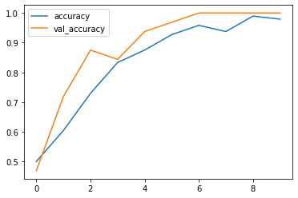
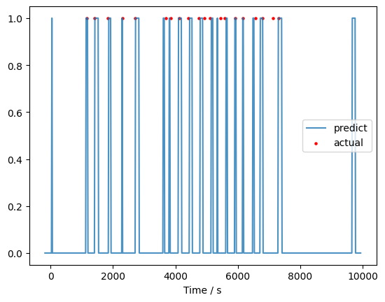

# ECE539 Project Proposal

__TITLE__: Singing livestream segmentation assistant

__KEY WORDS__: Audio classification, FFT, CNN, FIR, Speaker recognition

## Overview and background
This project focuses on the classification and segmentation of audio, particularly for distinguishing between singing and speech. The primary goal is to develop an accurate audio classifier and segmentation algorithm that can handle a mixture of speech and singing. 

Our target use case of this program is to slice singing livestream videos. To optimize the performance, the model will be trained with specific person's dataset if possible. 

## Dataset

- [gtzan_music_speech](https://www.kaggle.com/datasets/lnicalo/gtzan-musicspeech-collection/) is an open source dataset

- There are video on [bilibili](bilibili.com) in which a person only talk (no singing) and in which the same person only sing (no talking).
- The videos are crawled down (using Python, selenium and bilili), converted to audio, sliced into 30-second pieces, resampled at 22050KHz, and mixed into mono channel. (using Python and ffmpeg). This results in 661500 samples each piece.
Below is the summary of dataset
```
$ ls xxm_singing/*.wav | wc -l; ls xxm_speech/*.wav | wc -l
137
137

$ ffprobe -i xxm_singing/0.wav
  ......
  Duration: 00:00:30.00, bitrate: 352 kb/s
  Stream #0:0: Audio: pcm_s16le ([1][0][0][0] / 0x0001), 22050 Hz, 1 channels, s16, 352 kb/s
```


- There are also long (not splitted, ~150min each) videos in which a person sometimes talks and sometimes sings. There are human-labeled timestamps of starts of each singing. These labels are crawled, parsed using regular expression, and stored in hour,min,sec format as shown below. They are used to test and score the performance of our final program. 
```csv
$ cat crawler/label/BV1134y1g7qX.csv 
0, 19, 11
0, 35, 31
1, 30, 6
1, 35, 43
[...trunked...]
```

## Others' work
[Classifying Music and Speech with Machine Learning](https://medium.com/m2mtechconnect/classifying-music-and-speech-with-machine-learning-e036ffab002e)

- Data preprocessing: 

    We want the frequency domain features, so preprocessing requires transfer each 30-second audio into spectrogram (using FFT, chunk size and step size are hyper parameters to be tuned) and normalize the amplitude.

- Model:

    With above preprocessing, each input is a spectrogram matrix whose ith row is the ith chunk's frequency spectrum. Output is by one-hot coding, (e.g., music is [0 1] and speech is [1 0]). Then use CNN to connect input and output, and fit, evaluate the model.

- Result: below is from the reference post

    

## Reproduction of above work to fit our use case
I have reproduced the above work, and achieved similar accuracy. Then I applied the model to long mixed audio, and below is the block diagram of implementation:
```
    [Long audio]-->[CHUNK 1][CHUNK 2] ... [CHUNK N]
                      |
                      V
                    (FFT)-->[Spectrum]-->(CNN)-->[Probability of each chunk]
                                                             |
                                                             V
[Predict outcome]<--(Thredhold)<--[Filtered probability]<--(FIR)                                           
```


Below is the outcome we currently have, blue line is the predicted outcome from above model, red dot is from actual label. (1 for singing, 0 for speech)



We (human) listened to the false positive points and find at those points there is background music making the model predict them as singing. To fix this issue, speaker recognition will be applied to recognize the specific person's voice print.

Also, due to the FIR filter chosen, it will filter out long continuous positive points. This is consistent with our goal since we assume each song is in certain length, and human can jump to the time stamp to listen and do precise operation.

## Methods
- FFT
- CNN
- FIR
- 

## Tools and computing recourses
- Tensorflow and Keras
- Tesla T4 from Google Colab
