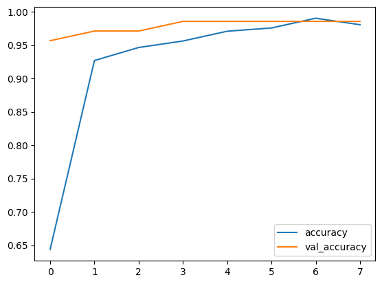

# ECE539 Project Proposal

__TITLE__: Singing livestream segmentation assistant

__KEY WORDS__: Audio classification, FFT, CNN, FIR, Speaker recognition

## Overview and background
This project focuses on the classification and segmentation of audio, particularly for distinguishing between singing and speech. The primary goal is to develop an accurate audio classifier and segmentation algorithm that can handle a mixture of speech and singing. 

Our target use case of this program is to slice singing livestream videos. To optimize the performance, the model will be trained with specific person's dataset if possible. 

In a previous study by Code AI Blogs (2021), titled "Classifying Music and Speech with Machine Learning," the authors demonstrated a successful approach to classifying audio into music or speech categories using convolutional neural networks (CNNs) [Code AI Blogs, 2021]. Their method involved preprocessing audio data, transforming it into the frequency domain using the Fast Fourier Transform (FFT), and using a CNN model for classification. The results indicated a high level of accuracy in distinguishing between music and speech.
## Dataset

- [gtzan_music_speech](https://www.kaggle.com/datasets/lnicalo/gtzan-musicspeech-collection/) is an open source dataset

- There are video on [bilibili](bilibili.com) in which a person only talk (no singing) and in which the same person only sing (no talking).
- The videos are crawled down (using Python, selenium and bilili), converted to audio, sliced into 30-second pieces, resampled at 22050KHz, and mixed into mono channel. (using Python and ffmpeg). This results in 661500 samples each piece.
Below is the summary of dataset
```
$ ls xxm_singing/*.wav | wc -l; ls xxm_speech/*.wav | wc -l
137
137

$ ffprobe -i xxm_singing/0.wav
  ......
  Duration: 00:00:30.00, bitrate: 352 kb/s
  Stream #0:0: Audio: pcm_s16le ([1][0][0][0] / 0x0001), 22050 Hz, 1 channels, s16, 352 kb/s
```


- There are also long (not splitted, ~150min each) videos in which a person sometimes talks and sometimes sings. There are human-labeled timestamps of starts of each singing. These labels are crawled, parsed using regular expression, and stored in hour,min,sec format as shown below. They are used to test and score the performance of our final program. 
```csv
$ cat crawler/label/BV1134y1g7qX.csv 
0, 19, 11
0, 35, 31
1, 30, 6
1, 35, 43
[...trunked...]
```

## Others' work
[Classifying Music and Speech with Machine Learning](https://medium.com/m2mtechconnect/classifying-music-and-speech-with-machine-learning-e036ffab002e)

- Data preprocessing: 

    We want the frequency domain features, so preprocessing requires transfer each 30-second audio into spectrogram (using FFT, chunk size and step size are hyper parameters to be tuned) and normalize the amplitude.

- Model:

    With above preprocessing, each input is a spectrogram matrix whose ith row is the ith chunk's frequency spectrum. Output is by one-hot coding, (e.g., music is [0 1] and speech is [1 0]). Then use CNN to connect input and output, and fit, evaluate the model.

- Result: below is from the reference post

    

## Reproduction of above work to fit our use case
I have reproduced the above work, and achieved similar accuracy. Then I applied the model to long mixed audio, and below is the block diagram of implementation:
```
    [Long audio]-->[CHUNK 1][CHUNK 2] ... [CHUNK N]
                      |
                      V
                    (FFT)-->[Spectrum]-->(CNN)-->[Probability of each chunk]
                                                             |
                                                             V
[Predict outcome]<--(Thredhold)<--[Filtered probability]<--(FIR)                                           
```


Below is the outcome we currently have, blue line is the predicted outcome from above model, red dot is from actual label. (1 for singing, 0 for speech)


We (human) listened to the false positive points and find at those points there is background music making the model predict them as singing. To fix this issue, speaker recognition will be applied to recognize the specific person's voice print.

Also, due to the FIR filter chosen, it will filter out long continuous positive points. This is consistent with our goal since we assume each song is in certain length, and human can jump to the time stamp to listen and do precise operation.

## Methods
- FFT
- CNN
- FIR

## Research Question
One notable question arising in the context of this project is how CNN models can effectively handle audio data in a matrix format where axis0 represents the frequency domain and axis1 represents the time domain. We will investigate this challenge and explore potential solutions.

## Project Plan
- _Initial Project Proposal_ :
-   The project begins with the preparation of an initial project proposal outlining the goals, methods, and expected outcomes. This proposal serves as a         roadmap for the entire project. Tentative Completion Date: (10/20/2023)
- _Environment Setup_ :
-   We will build up our project environment utilizing Google Collab and GitHub for easy collaboration and development. The GitHub repository will include        all project-related documents, including code, figures, diagrams, and the final presentation slides.
- _Verify Previous Works Model_ :
-   We will go through the previous works model as seen in this proposal already, we will be going even in depth to ensure critical analysis and                  understanding feasibility of the project.
- _Research Optimiazation_ :
-   To enhance our audio classification model, we will conduct a comprehensive review of existing models in the field of online videos in our chosen              platform. Our goal is to identify potential optimizations that can be applied to our model, leading to improved accuracy and efficiency.
- _Data Preprocessing_ :
-   Data preprocessing is a critical step in preparing the dataset for training. We will clean and preprocess the data from TensorFlow, ensuring that they       are appropriately formatted and ready for use in our classification model. However, we are certain that the data has already been cleaned and is ready       for usage.
- _Begin Convolutional Neural Network Model_ :
-   The project will start with the development of a CNN model, focusing on distinguishing between different types of audio segments, specifically between       voice and music. This foundational model will provide insights into the performance of our approach.
- _Submit Project Progress Report_ :
-   At this stage, we will submit a project progress report, summarizing the work done so far, including data preprocessing, the binary classification           model's development, and any initial findings or challenges encountered. Tentative Completion Date: (11/18/2023)
- _Train CNN Model_ :
-   Continuing our work, we will train the CNN model using the preprocessed data. Simultaneously, we will commence the development of data data-adaptive         training algorithm as well. 
- _Test Model_ :
-   We will rigorously test our CNN model on the testing dataset to evaluate its accuracy and performance. This process involves feeding untrained images        from the same distribution to the model and assessing its predictive capabilities. The results will be logged and used to determine the most effective       model.
- _Evaluate Results_ :
-   An in-depth evaluation of the model's performance will be carried out, including metrics such as accuracy, precision, recall, and F1 score. The goal is      to assess how well the model classifies brain tumor images and its suitability for practical medical applications.
- _Visualize Results_ :
  Visualization of the model's performance and classification results will be essential to convey our findings effectively. Visual aids, such as plots and     charts, will be used to present the results clearly and intuitively. This will heavily use the matplotlib libraries of Python.
- _Work on Presentation_ :
-   The project presentation will be prepared, summarizing the entire project, methodologies, findings, and key takeaways. This presentation is crucial for      sharing our work with peers and stakeholders. Tentative Completion Date: (12/11/2023)
- _Work on the Final Report_ :
-   The final project report will be composed, providing a comprehensive overview of the entire project. It will include details on the problem statement,       methodology, results, discussion, and conclusions. The report serves as a record of our work and findings. Tentative Completion Date: (12/14/2023)
-   


## Tools and computing recourses
- Tensorflow and Keras
- Tesla T4 from Google Colab

## References
•	Code AI Blogs "Classifying Music and Speech with Machine Learning." Medium, [https://medium.com/m2mtechconnect/classifying-music-and-speech-with-machine-learning-e036ffab002e], 2021.
•	TensorFlow. "gtzan_music_speech Dataset." TensorFlow Datasets, [https://www.tensorflow.org/datasets/catalog/gtzan_music_speech].

